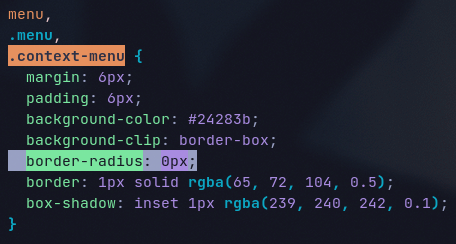

# 👽 Rice


## 📋 Details

### Components
- OS: [Arch Linux](https://archlinux.org/)
- Shell: [Bash](https://www.gnu.org/software/bash/)
- Fetch: [Nitch](https://github.com/unxsh/nitch)
- Terminal: [Alacritty](https://github.com/alacritty/alacritty)
- TWM: [Bspwm](https://github.com/baskerville/bspwm)
- Compositor: [Picom](https://github.com/yshui/picom)
- Status bar: [Polybar](https://github.com/polybar/polybar) (with [openweather-simple](https://github.com/polybar/polybar-scripts/tree/master/polybar-scripts/openweathermap-simple))
- App launcher: [Rofi](https://github.com/davatorium/rofi)
- File manager: [Nemo](https://github.com/linuxmint/nemo)
- Hotkey daemon: [Sxhkd](https://github.com/baskerville/sxhkd)
- Browser: [Brave](https://github.com/brave/brave-browser)
- Note taking: [Logseq](https://github.com/logseq/logseq)
- Discord client: [BetterDiscord](https://github.com/BetterDiscord/BetterDiscord)
- Code editor: [Vscodium](https://github.com/VSCodium/vscodium)
- Video/audio player: [mpv](https://github.com/mpv-player/mpv)
- Countdown/Stopwatch: [Termdown](https://github.com/trehn/termdown)
- Terminal search for Youtube: [Ytfzf](https://github.com/pystardust/ytfzf)
- Screen capture: [Flameshot](https://github.com/flameshot-org/flameshot)
- Page color scheme: [Dark Reader](https://chrome.google.com/webstore/detail/dark-reader/eimadpbcbfnmbkopoojfekhnkhdbieeh?hl=en)
- Some scripts

### Themes
- Dark Reader: Tokyonight (**built-in**)
- GTK-3.0: [Tokyonight](https://github.com/Fausto-Korpsvart/Tokyo-Night-GTK-Theme) (**modified**)
- Brave: [Catppuccin Mocha](https://chrome.google.com/webstore/detail/catppuccin-chrome-theme-m/bkkmolkhemgaeaeggcmfbghljjjoofoh) (**modified**)
- Vscodium: [Tokyonight](https://github.com/enkia/tokyo-night-vscode-theme)
- Discord (BetterDiscord): [Tokyonight](https://github.com/Dyzean/Tokyo-Night)
- Rofi: [Tokyonight](https://github.com/Arsemy/rofi-collection)
- Logseq: [Ayu](https://github.com/nmartin84/logseq-tokyo-theme)
- Icons: [Kora](https://github.com/bikass/kora)
- Fonts: [JetBrains Mono](https://github.com/JetBrains/JetBrainsMono) && [Cascadia code](https://github.com/microsoft/cascadia-code)

## ⚙️ Modified things

### GTK - Tokyonight
If you want to disable the rounded corner of pop-up menu, then modify this
```
$HOME/.local/share/themes/Tokyonight-Dark-BL/gtk-3.0/gtk.css
```
(if you're using `gtk-application-prefer-dark-theme=true` on `.config/gtk-3.0/settings.ini`, then modify `gtk-dark.css` instead of `gtk.css`)

Now set `border-radius` to `0px` on `menu,.menu,.context-menu`.



### Brave - Catppuccin Mocha
If you want to change the pastel pink letter color of search bar, then modify this
```
$HOME/.config/BraveSoftware/Brave-Browser/Default/Extensions/bkkmolkhemgaeaeggcmfbghljjjoofoh/3.0_0/manifest.json
```
or you can locate with this
```
find $HOME/.config/BraveSoftware -type f -iname manifest.json -print0 | xargs -0 grep Catppuccin
```
Now set `ntp-link` and `omnibox-text` to `[ 245 224 220 ]`.

To load the modified Catppuccin Mocha theme:
 - Go to `brave://extensions/`
 - Enable *Developer mode*
 - Click on *Load unpacked*
 - Select the folder of `manisfest.json` alredy modified

## 📜 Some scripts

### print-maim
Shows a "+" to select a window or area to print, then moves the screenshot to clipboard and /tmp

- Dependencies:
	- [maim](https://github.com/naelstrof/maim)
	- [xclip](https://github.com/astrand/xclip)

Note: print-maim-delayed is the same, but with 5 seconds of delay

### monocle-0-1
Capture when monocle mode in bspwm is on or off. I use this with a picom opacity rule `"0:monocle@:32c = 1 && !focused"` the result of this is what you see on the image below.


Instead of this


## 🗿 Others...

### Inspirations 
- `dotfiles` [HynDuf7/dotfiles](https://github.com/HynDuf7/dotfiles)
- `dotfiles` [r/unixporn](https://www.reddit.com/r/unixporn/)

### Notes
- if any english grammar is wrong, please make a pull request or tell me on [reddit](https://www.reddit.com/user/Arsemy)
