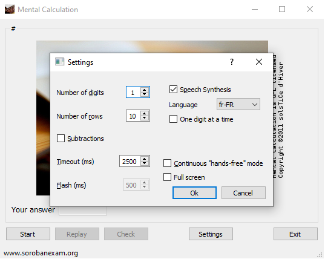

*Mental calculation* a simple tool made, to practice *anzan* - mental calculation made by visualizing a soroban, the japanese abacus.

It flashes number and you have to provide the result of the operation (addition and/or subtraction). You are free to use or not anzan for doing the calculation of course, because this is your mental processing the operation.

http://en.wikipedia.org/wiki/Soroban

# Requirements

    - python 3.6 or more recent
    - PyQt5
    - and PyQt5/QtMultimedia and with a working backend for speech synthesis

You need to generate the python files needed for the gui with the following commands:
  
    cd gui
    pyuic5 settings.ui > settings.py
    pyuic5 main.ui > main.py

To install the __dependencies__ by using _pip_, you can run:

    pip install -r requirements.txt

If you want to use the package of your OS (say Linux distro), you will need to install:

    - python3
    - pyqt5
    - qt5 / qtmultimedia
    - Qt5 phonon and a backend (for speech synthesis)

For example, on Ubuntu 22.04, in one line, this will be:

    sudo apt install python3-pyqt5 python3-pyqt5.qtmultimedia libqt5multimedia5-plugins pyqt5-dev-tools

# Configuration

The details of the configuration file is documented in [configuration.md](configuration.md)

# Tracking Usage

With the 0.3.5 release, every time you launch *mentalcalculation*, it tries to reach `https://www.sorobanexam.org/mentalcalculation?ping=UUID` at every launch.

The *UUID* is a randomly generated uuid v4. No information is sent. It just allows us to gather statistics about the usage of this software and know if people only download it once and never use it again, or if it is really used often.

You might not like that tracking behavior, so you can opt-out. In the configuration file `mentalcalculation.ini`, you can add a line:

    uuid=opt-out

in the ``[General]`` section; you can also use any of the following values: no, No, none, None, false, False, optout or leave it empty.

Or if the line is already there, just change the value of uuid to one of the string mentionned above to opt-out.

Note:
This request is also used to get the last version of mentalcalculation, and display a message to update, if need be.

# Fail-safe mechanism

There is a fail-safe mechanism that allows *mental calculation* to safely fail when it does not find one of its resources files. So, if you don't like the smileys/emoticons or the sounds, you can safely delete/rename them on your harddisk (img/sound directories), and *mentalcalculation* will continue to work without them.

# Attribution

I would like to thank the Tango project from which I borrowed some icons and the GNOME project (gnome-media, gnome-audio) for the sound files I use.

Soroban image courtesy of burlie (@Flickr) see http://www.flickr.com/photos/burls/
